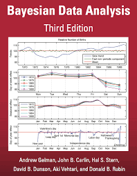

# Stan

Bayesian Data Analysis, Third Edition continues to take an applied approach to analysis using up-to-date Bayesian methods. The authors—all leaders in the statistics community—introduce basic concepts from a data-analytic perspective before presenting advanced methods. Throughout the text, numerous worked examples drawn from real applications and research emphasize the use of Bayesian inference in practice.

The book can be used in three different ways. For undergraduate students, it introduces Bayesian inference starting from first principles. For graduate students, the text presents effective current approaches to Bayesian modeling and computation in statistics and related fields. For researchers, it provides an assortment of Bayesian methods in applied statistics. Additional materials, including data sets used in the examples, solutions to selected exercises, and software instructions, are available on the book’s web page.

This repository covers the classic schools example in Stan, from BDA3.