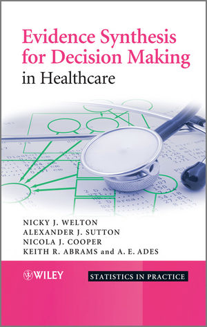

# Getting Started with Stan

This repository includes exercises from the book [Bayesian Data Analysis](http://www.stat.columbia.edu/~gelman/book/) (BDA3), a survival analysis workshop, and translated JAGS to Stan code from the book [Evidence Synthesis for Decision Making in Healthcare](https://www.wiley.com/en-sg/Evidence+Synthesis+for+Decision+Making+in+Healthcare-p-9780470061091). More details on both books can be found below.

---
## BDA3

BDA3 continues to take an applied approach to analysis using up-to-date Bayesian methods. The authors—all leaders in the statistics community—introduce basic concepts from a data-analytic perspective before presenting advanced methods. Throughout the text, numerous worked examples drawn from real applications and research emphasize the use of Bayesian inference in practice.

The book can be used in three different ways. For undergraduate students, it introduces Bayesian inference starting from first principles. For graduate students, the text presents effective current approaches to Bayesian modeling and computation in statistics and related fields. For researchers, it provides an assortment of Bayesian methods in applied statistics. Additional materials, including data sets used in the examples, solutions to selected exercises, and software instructions, are available on the book’s web page.

---

## Evidence Synthesis for Decision Making

In the evaluation of healthcare, rigorous methods of quantitative assessment are necessary to establish interventions that are both effective and cost-effective. Usually a single study will not fully address these issues and it is desirable to synthesize evidence from multiple sources. This book aims to provide a practical guide to evidence synthesis for the purpose of decision making, starting with a simple single parameter model, where all studies estimate the same quantity (pairwise meta-analysis) and progressing to more complex multi-parameter structures (including meta-regression, mixed treatment comparisons, Markov models of disease progression, and epidemiology models). A comprehensive, coherent framework is adopted and estimated using Bayesian methods.

---